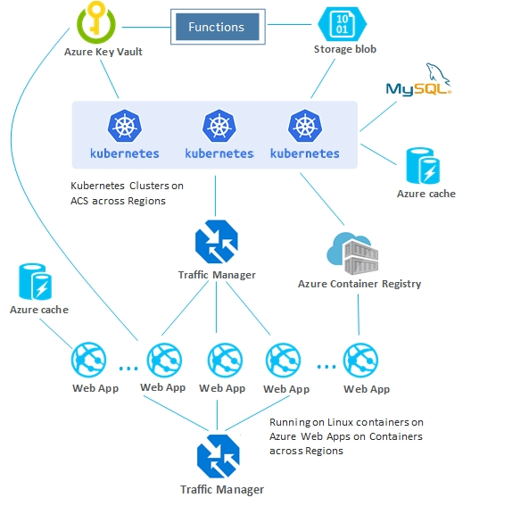

# Movie Database App using Java on Azure #

The purpose of this sample application is to illustrate a modern Java app in the cloud; the result of this project will be to create a movie database simliar to IMDB.

## Requirements ##

In order to create and deploy this sample application, you need to have the following:

An Azure subscription; if you don't already have an Azure subscription, you can activate your [MSDN subscriber benefits](https://azure.microsoft.com/pricing/member-offers/msdn-benefits-details/) or sign up for a [free Azure account](https://azure.microsoft.com/pricing/free-trial/).

In addition, you will need all of the following components before you go through the steps in this README:

| [Azure CLI](http://docs.microsoft.com/cli/azure/overview) | [Java 8](http://java.oracle.com/) | [Maven 3](http://maven.apache.org/) | [Git](https://github.com/) | [Docker](https://www.docker.com/) |

**NOTE**: There are additional requirements in the *[~/deployment/README.md](deployment/README.md)* file which are required in order to setup your development environment; other required components will be installed automatically by the provisioning scripts.

## Overview ##

In the following sections, you will create a development sandbox environment on Azure which uses the following components:

- web apps in Linux containers on [Azure App Service (AAS)](https://azure.microsoft.com/en-us/services/app-service/)

- Data apps in Kubernetes clusters in the [Azure Container Service (ACS)](https://azure.microsoft.com/en-us/services/container-service/)

- [Azure Container Registry (ACR)](https://azure.microsoft.com/en-us/services/container-registry/) for container images

- [Azure Database for MySQL](https://azure.microsoft.com/en-us/services/mysql/) for data

- [Azure Storage](https://azure.microsoft.com/en-us/services/storage/) for media contents

The following diagram illustrates the full topology for this sample application enviroment:

   

In this basic layout, the following design decisions have been implemented:

- Internet-facing web apps are running in Linux containers on AAS, which can run across multiple regions worldwide.

- For better performace, this enviroment uses the following:

   - [Azure Traffic Manager](https://azure.microsoft.com/en-us/services/traffic-manager/) to route requests for better performance and availability.
   
   - [Azure Redis Cache](https://azure.microsoft.com/en-us/services/cache/) for high throughput and low-latency.

- Container images for the web apps are built using Docker and pushed to a managed private Docker registry in ACR, and deployed to Linux containers on AAS.

- The web apps communicate with the data apps running in Kubernetes clusters in ACS.

- Data apps are REST API apps which store and read data from Azure Database for MySQL, which is a fully managed database as a service; data apps store images into and read images from Azure Storage.

- Another traffic manager is deployed as a load balancer in the front of data apps for routing requests for better performance and availability.

**Note**: For now, Node.js is being used instead of Java in this sample application for the Azure functions; this will be updated in the near future.

## Create and Deploy the Sample Application ##

### Download and customize the sample for your development environment ###

1. Follow the steps in the *[~/deployment/README.md](deployment/README.md)* file of the sample project to clone the project repo and set up your development environment.

1. Navigate to the configuration directory for your Maven installation; for example: */usr/local/maven/3.5.0/libexec/conf/* or *%ProgramFiles%\apache-maven\3.5.0\conf*:

   a. Open the *settings.xml* file with a text editor.

   b. Add parameterized settings for ACR access settings to the `<servers>` collection in the the *settings.xml* file, this will enable Maven to use a private registry; for example:

      ```xml
      <servers>
         <server>
            <id>${env.ACR_LOGIN_SERVER}</id>
            <username>${env.ACR_USERNAME}</username>
            <password>${env.ACR_PASSWORD}</password>
            <configuration>
               <email>john_doe@contoso.com</email>
            </configuration>
         </server>
      </servers>
      ```

   c. Save and close your *settings.xml* file.

<a name="create-the-initial-build"></a>
### Create the initial build ###

1. Open a command prompt and navigate to the *~/deployment/* folder of your local repo.

1. Login to your Azure account and specify which subscription to use:

   ```shell
   az login
   az account set --subscription "<your-azure-subscription>"
   ```

   **NOTE**: You can use either a subscription name or id when specifying which subscription to use; to obtain a list of your subscriptions, type `az account list`.

1. **For Microsoft developers**, we have network security group rules applied to the resources
   in the development subscriptions which restrict the network access from the internal CORP network. 
   This blocks the SSH communications between the VM's provisioned in this project.

   To workaround this, set the environment variable `MS_CORP` before you start the provision process:

   ```shell
   export MS_CORP=1
   ```

1. Build an initial layout on Azure using an ARM template from using one of the following methods:

   ```shell
   source provision.sh
   ```
   > **NOTE**: On Windows, run all shell scripts in Git Bash.  

   The provisioning script will create the following resources in Azure, which may take a long time to complete:

   * A MySQL instance
   * A Redis Cache instance
   * A Function app for resizing images
   * Two traffic managers for load balancing
   * An Azure Container Registry for hosting a private Docker image
   * Two Linux-based web apps for front-end websites
   * Two Azure Container Services (Kubernetes Clusters) for REST API services
   * An Azure Container Service (Kubernetes Cluster) for a Jenkins server

### Deploy Java function to Azure Functions using Maven plugin


1. Open a command prompt and navigate to the folder which contains the function app, which is located in the "*~/function-app/*" folder of your repo; this is a Java function app which:

   * Re-sizes images uploaded to Azure Storage

   * Trigger by an Azure Blob upload action.

1. Build the data app:

   ```shell
   mvn clean package
   ```

1. Deploy the function app to Azure Functions using Maven plugin:

   ```shell    
   mvn azure-functions:deploy
   ```


### Deploy the internal-facing data app into a Kubernetes cluster in ACS ###


1. Open a command prompt and navigate to the folder which contains the data app, which is located in the "*~/data-app/*" folder of your repo; this is a Spring Boot app which:

   * Stores and reads data from Azure Database for MySQL using Spring JDBC

   * Stores images into and reads images from Azure Storage.

1. Build and dockerize the data app, and push the container into ACR:

   ```shell
   mvn package docker:build -DpushImage
   ```

1. Deploy the data app to a Kubernetes cluster in ACS [using Maven](https://docs.microsoft.com/en-us/azure/container-service/kubernetes/container-service-deploy-spring-boot-app-using-fabric8-maven-plugin):

   ```shell    
   mvn clean fabric8:resource fabric8:apply
   ```

1. Run below command to watch the creation process of your service object in Kubernetes.
   Wait until column `EXTERNAL-IP` has a valid IP address, which means your data app is accessible from internet now.

   ```shell
   kubectl get svc --namespace=${TARGET_ENV} --watch
   ```

1. Navigate to the *~/deployment/* folder of your local repo and run the following script, which will configure various variables for your local enviroment:

   ```shell
   cd ../deployment
   source dev_setup.sh
   ```

   **NOTE**: Microsoft is currently developing a Maven plugin to deploy to a Kubernetes cluster in Azure Container Service, so in the future you will be able to use `mvn deploy`.

#### Test your data app deployment ####

Run the following command to test whether your data app was successfully deployed:

   ```shell
   curl http://${DATA_API_URL}/api/v1
   ```

### Deploy the Internet-facing web app into Linux containers in AAS ###

1. Open the Internet-facing web app, which is located in the "*~/web-app/*" folder of your repo.

   * This is also a Spring Boot app which talks to the data app that we just deployed.
   
   * The web app can also use Azure Redis Cache using Spring Data Redis.

1. Build and dockerize the web app, and push the container into ACR:

   ```shell
   mvn package docker:build -DpushImage
   ```

1. Use [Maven plugin for Azure Web Apps](https://github.com/Microsoft/azure-maven-plugins/tree/master/azure-webapp-maven-plugin) 
to deploy the web app to a Linux container in Azure App Service:

   ```shell
   mvn azure-webapp:deploy -Dwebapp.resourceGroup=${EAST_US_GROUP} -Dwebapp.appName=${EAST_US_WEBAPP_NAME}
   ```

   Learn more details about how to use Maven Plugin for Azure Web Apps with Azure Container Registry from 
   [this step-by-step tutorial](https://docs.microsoft.com/en-us/azure/app-service-web/app-service-web-deploy-spring-boot-app-from-container-registry-using-maven-plugin) at Microsoft Docs Site.

#### Test and diagnose your sample deployment ####

Test and diagnose using one of the following two methods:

   * Open website in a web browser
      ```
      open http://${EAST_US_WEBAPP_NAME}.azurewebsites.net/
      ```

   * Run the following command in a console window:
      ```shell
      curl http://${EAST_US_WEBAPP_NAME}.azurewebsites.net/index
      ```

### OPTIONAL: Enable monitoring and diagnostics using third party services ###

You can optionally enable *New Relic* and *OverOps* monitoring and diagnostics in both the web app and data app by using the steps in the following sections.

#### Enable New Relic ####

To enable monitoring using *New Relic*, use the following steps.

- Open a console and navigate to the `~/web-app` folder in your local repo.

- Configure the following environment variables:

   ```shell
   export NEW_RELIC_LICENSE_KEY=<your-new-relic-license-key>
   export WEBAPP_NEW_RELIC_APP_NAME=<app-name-in-new-relic>
   ```

- Run the following command to build an image with New Relic and push the image to ACR; for example, if your image name is *web-app-w-new-relic*:

   ```shell
   mvn package docker:build@with-new-relic -DpushImage
   ```

- Run the following commands to deploy the web app to AAS:

   ```shell
   mvn azure-webapp:deploy@with-new-relic -Dwebapp.resourceGroup=${EAST_US_GROUP} -Dwebapp.appName=${EAST_US_WEBAPP_NAME}
   ```

- Browse to your account portal in New Relic to see real-time monitoring data.

#### Enable OverOps ####

To enable diagnostics using *OverOps*, use the following steps.

- Open a console and navigate to the `~/web-app` folder in your local repo.

- Configure the following environment variables:

   ```shell
   export OVEROPSSK=<your-overops-sk>
   ```

- Run the following command to build an image with OverOps and push the image to ACR; for example, if your image name is *web-app-w-overops*:

   ```shell
   mvn package docker:build@with-overops -DpushImage
   ```

- Run the following commands to deploy the web app to AAS:

   ```shell
   mvn azure-webapp:deploy@with-overops -Dwebapp.resourceGroup=${EAST_US_GROUP} -Dwebapp.appName=${EAST_US_WEBAPP_NAME}
   ```

- Browse to your account portal in OverOps to see real-time diagnostic data.

#### Enable Azure Application Insights ####

To enable monitoring using *Azure Application Insights*, use the following steps.

- [Get an Application Insights instrumentation key](https://docs.microsoft.com/en-us/azure/application-insights/app-insights-java-get-started)

- Put the key into ~/web-app/src/main/java/com/microsoft/azure/java/samples/moviedb/web/AppInsightsConfig.java

- Redeploy your application


<!--

* **App Dynamics**

> **NOTE**: Detailed notes will be included here at a later date.

* **Dynatrace**

> **NOTE**: Detailed notes will be included here at a later date.

-->

### Automate continuous integration and continuous deployment (CI/CD) using Jenkins ###

1. Use an existing Jenkins instance, setup continuous delivery - build and configure pipeline using:

   a. A pipeline config file from the cloned repo

   b. The forked repo

   As part of the [initial build](#create-the-initial-build), a Jenkins cluster with pipelines is setup in a Kubernetes cluster in Azure Container Service. You can see that at:

   ```shell
   http://${JENKINS_URL}
   ```
<!--

> **NOTE**: Add a screenshot of the Jenkins dashboard here

> **NOTE**: Add the steps to login with the Jenkins CLI

-->

1. Download the Jenkins CLI JAR from your Jenkins server; for example:

   ```shell
   curl -O http://${JENKINS_URL}/jnlpJars/jenkins-cli.jar
   ```

1. Log into your Jenkins Dashboard, then build and deploy the development, test and production releases for these environments:

   ```shell
   java -jar jenkins-cli.jar -s \
      http://${JENKINS_URL}/ login
   java -jar jenkins-cli.jar -s \
      http://${JENKINS_URL}/ \
      build 'movie-db-pipeline-for-dev' -f -v
   ```

   **NOTE**: Job *movie-db-pipeline-for-dev* is for `dev` environment you created in previous section.

   If you want to have `test` and `prod` environments, you will first need create them using below commands.
   ```shell
   cd ./deployment
   source provision.sh --env test
   source provision.sh --env prod
   ```
   Then you can build the `test` and `prod` environments using similar steps; e.g. `build 'movie-db-pipeline-for-test' -f -v`.


### Continue to develop apps and rapidly deploy them ###

The steps in this section will walk you through the steps to make a simple change to your web app and see those changes reflected on the hom page when you browse to your web app.

1. Using IntelliJ change the name of the web app in the *~/web-app/src/main/resources/templates/index.html* page; for example:

   ```html
   <h1 class="cover-heading">Welcome to My Cool Movie DB on Azure!!!</h1>
   ```

1. Using IntelliJ and Maven, build, deploy and test the web app:

   ```shell
   mvn spring-boot:run
   curl http://localhost:8080/
   ```

1. Using IntelliJ and Git, push changes to the forked repo when you are satisfied with the changes:

   ```shell
   git push origin master
   ```

1. Watch Jenkins building and deploying dev and test releases on the Jenkins Dashboard (triggered by GitHub)

   Go to `http://${JENKINS_URL}`

1. Trigger a new build of job `movie-db-pipeline-for-dev` to deploy your latest changes to `dev` environment.

1. Once these steps have been completed, you should see your updated title on the home page of your web app.

### Scale apps ###

1. Scale out Internet facing web apps

   ```shell
   az appservice plan update --number-of-workers 6 \
      --name ${EAST_US_WEBAPP_PLAN} \
      --resource-group ${EAST_US_GROUP}

   az appservice plan update --number-of-workers 6 \
      --name ${WEST_EUROPE_WEBAPP_PLAN} \
      --resource-group ${WEST_EUROPE_GROUP}
   ```

## Sample Application Summary ##

In review, this sample application utilized all of the following design concepts and technologies.

### Web App Design ###

- It is a Spring Boot app with an embedded Tomcat server
- It can run in Linux Containers in Azure App Service
<!-- The Spring Boot app starts up using secrets stored in Azure Key Vault. App uses Spring Cloud Vault to access secrets inside Azure Key Vault, a "Secret Backend" -->
- App uses Azure Redis Cache and accesses it using Spring Data Redis

> **NOTE**: In the future the app secrets will be stored in an Azure Key Vault.

### Data App Design ###

- It is a Spring Boot app with an embedded Tomcat server
- It can run in Kubernetes clusters in Azure Container Service
<!-- The Spring Boot app starts up using secrets stored in Azure Key Vault. Uses Spring Cloud Vault to access secrets from Azure Key Vault, a "Secret Backend" -->
- App uses Azure Redis Cache and accesses it using Spring Data Redis
- App stores and fetches images into and from Azure Storage
- App stores and reads app data into and from SQL MySQL-as-a-service using Spring JDBC

> **NOTE**: In the future the app secrets will be stored in an Azure Key Vault.

### Functions Design ###

- They are used for independent micro computations
- They are used for linking two disconnected units in a workflow - re-sizes images uploaded to Azure Storage. They are triggered by an Azure Blob upload action.

## Troubleshooting ##

This section will document some of the issues which have been identified when trying to build and deploy this sample application; more will be added as different issues are discovered.

### 'Permission Denied' error when creating the data app ###

When you are attempting to build the data app, you might encounter the following error:

`[ERROR] Failed to execute goal com.spotify:docker-maven-plugin:0.4.11:build (default-cli) on project data-app: Exception caught: java.util.concurrent.ExecutionException: com.spotify.docker.client.shaded.javax.ws.rs.ProcessingException: java.io.IOException: Permission denied`

This error is caused when your user account does not have permissions to create the necessary socket for Docker; more details are available in [Solving Docker permission denied while trying to connect to the Docker daemon socket](https://techoverflow.net/2017/03/01/solving-docker-permission-denied-while-trying-to-connect-to-the-docker-daemon-socket/).

### 'Password Complexity' errors when provisioning the sample application ###

Some of the Azure services have various password complexity requirements; as a result, you may encounter various errors related to password complexity when you are running the provision scripts. In order to avoid or resolve these issues, you should ensure that the passwords which you choose adhere to standards; for example, at the very least you should choose passwords which have a mixture of uppercase letters, lowercase letters, numbers, and punctuation.

## Contributing ##

This project has adopted the [Microsoft Open Source Code of Conduct](https://opensource.microsoft.com/codeofconduct/). For more information see the [Code of Conduct FAQ](https://opensource.microsoft.com/codeofconduct/faq/) or contact [opencode@microsoft.com](mailto:opencode@microsoft.com) with any additional questions or comments.

## Disclaimer ##

**Note**: The sample code, scripts, and documentation in this sample application are not supported under any Microsoft standard support program or service. This sample application is provided AS IS without warranty of any kind. Microsoft disclaims all implied warranties including, without limitation, any implied warranties of merchantability or of fitness for a particular purpose. The entire risk arising out of the use or performance of this sample application remains with you. In no event shall Microsoft, its authors, or anyone else involved in the creation, production, or delivery of the scripts be liable for any damages whatsoever (including, without limitation, damages for loss of business profits, business interruption, loss of business information, or other pecuniary loss) arising out of the use of or inability to use this sample application, even if Microsoft has been advised of the possibility of such damages. 
